# Data Exploration🏒
- Qualitative (Categorial) Attributes / Quantitative (Numeric) Attributes
- Descriptive Statistics
- **Plot Types** : histogram, boxplot, bell curve (normal dis), bar chart, line chart, pie/donut chart, sunburst chart, scatter plot, parallel chart, deviation chart
- Rapid Miner Examples
- Data Exploration Roadmap
## Qualitative (Categorical) Attributes
### Nominal
- Values represent different categories or labels without any inherent order or ranking
- they are often used to represent names or labels associated with objects
- example : colors, jobs, animals
- statistics : **mode**, entropy, correlation
- Binomial : only 2 possible values (0/1)
- Polynomial : more than 2 possible values
### Ordinal
- Values process a **meaningful order or ranking**, but the magnitude between values is not precisely quantified (not known)
- statistics : **median**, percentile
- example : grades, shirt size
## Quantitative (Numeric) Attributes
### Interval
- an interval scaled attribute has values, whose **differences are interpretable**. **Lacks true zero** (zero point doesn't signify the complete absence of the value being measured)
- like when a temperature of 10C shouldn't be considered as twice as hot as 5 degrees C (cuz it would conflict for other types of temp measurements, like when converting to F, its not twice as hot anymore)
- statistics : **mean**, stdev
- example : temperature (0C doesnt mean theres no temperature), pH scale, shirt size(number), SAT score(lacks true 0)
### Ratio
- **includes true zero**, the **ratio of two measurements has a meaningful interpretation**
- like when a weight of 4 grams is twice as heavy as weight of 2 grams
- example : age (0 year means beginning of life), money, height in cm, scores (that has true zero)
## Descriptive Statistics

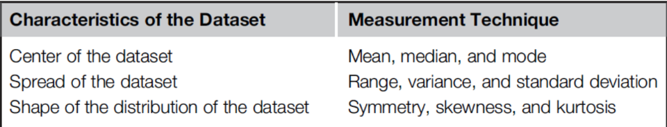

Measure of **central tendency** (single value that describes the typical or middle value of a dataset, summarizing the center of its distribution)
- **Numeric attribute (eg. scores)** : mean, median
- **Nominal attribute (eg. classes)** : mode
Measure of **spread** -> for numeric attribute
- Range : max - min
- Variance : how data points in a set are spread out from their mean
- SD : square root of the variance

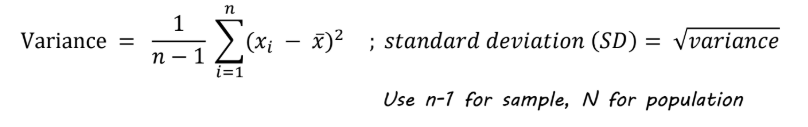

**Shape of distribution**
- Numeric attribute : histogram, normal dis curve
- Nominal attribute : frequencies
## Plot Types
**Visualizing 1 attr**
- Histrogram
- Boxplot
- Bell curve
**Visualizing 2-3 attr** : Based on X-Y axis and colors
- Boxplot
- Bell Curve
- Bar chart
- Line Chart
- Pie/Donut Chart
- Sunburst Chart
- Scatter plot, scatter matrix
**Visualizing > 3 attr** : An axis is shared by >1 attributes
- Parallel chart
- Deviation chart
### Histrogram
- Shows the **distribution of a single continuous variable** by grouping data into ranges
- Helps detect skewness, outliers, data spread
- Best for understanding **how data is spread out**
### Box plot
- Summarizes data distribution using 
	- Minimum
	- Q1 (25th percentile)
	- Median
	- Q3 (75th percentile)
	- Maximum
- Box = interquartile range (Q1-Q3)
- Line in the box = Median
- Dots = Outliers
- Ideal for comparing distributions and spotting outliners quickly
### Bell curve (normal distribution curve)
- Represents data that follows a **normal (Gaussian) distribution**
- Mean, median, and mode are all at the center
- **Rule**:
	- 68% of data within 1 standard deviation (σ)
	- 95% within 2σ
	- 99.7% within 3σ
- Helps determine if data follows a normal distribution

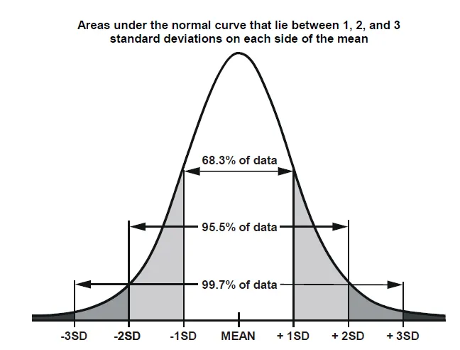

### Bar chart
- Shows comparisons between discrete categories
- **X-axis:** Categories
- **Y-axis:** Value or count
- Uses to compare categorical data
### Line chart
- Visutalizes trends overtime
- X-axis : Time or **continuous variable**
- Y-axis : Measurement value
- Data points connected by a line
- Eg : stock over months
- Uses for identifying patterns, growth or declines over time
### Pie/donut chart
- Shows proportions as slices of a circle
- Ideal for quick visual comparison of proportion
- Donut = 100%
### Sunburst chart
- Displays **hierarchical data** using concentric circles, compare **proportions in different categories** of multiple NOMINAL variables

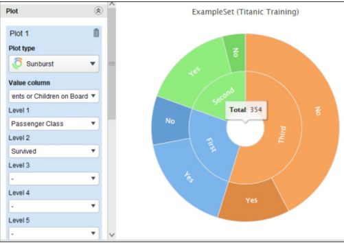

- example : out of 354 ppl on board, how many of them are in different categories of passenger class (inner circle) and survived (outer circle)
- Center circle : main category
- Outer circles : sub-categories
- Size of each segment represents quantity
- Good for **showing how catagories are broken down into sub-levels**
### Scatter plot, scatter matrix
- shows **relationship between two continuous variables**
- **X-axis** = variable 1
- **Y-axis** = variable 2
- Each point = one observation

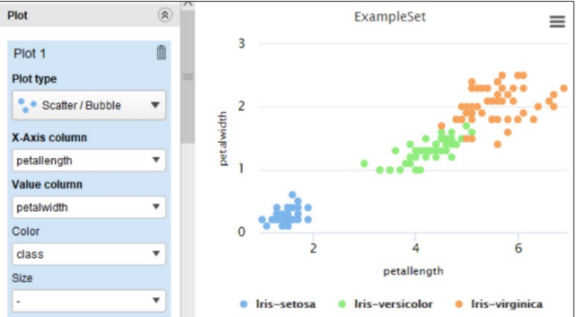

- eg : petal width, petal length
- Scatter Matrix (pair plot) : shows scatter plots for ALL PAIRS of variables in a dataset
- eg : **exploring relationships between multiple factors** like age, income, spending score in customer data
### Parallel chart
- visualizes multi-dimensional data
- attributes = X-axis
- Since Y-axis is shared by many attributes, **attributes should be normalized to have similiar range**
- Useful for **quick observation of class differences** exhibited by each attribute
- Each line connects the **values of all attributes** 

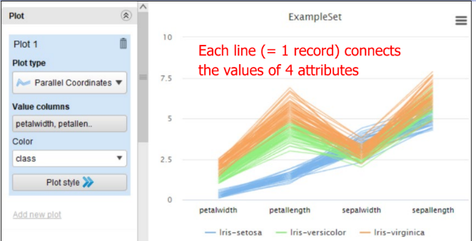

- This example : 4 attributes (petalwidth, length, sepalwidth, length)
- Makes high-dimensional data easier to interpret
### Deviation chart
- Instead of showing individual lines for individual records like in parallel chart, only **mean & SD of each category are shown**
- Uses for quick assessment of **the spread of each class for each attribute**

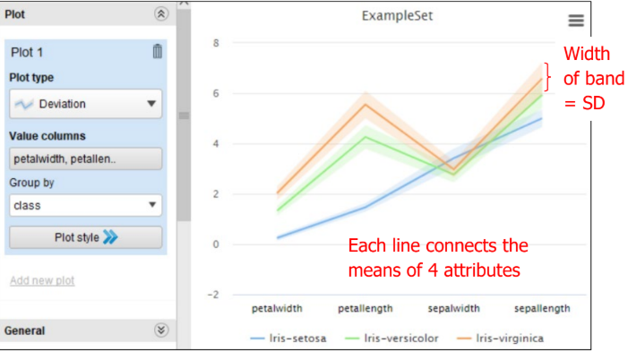
## Rapid Miner
### 2.1 Visualization

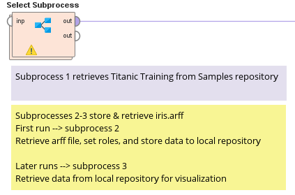

#### Subprocess 1
Retrieve Titanic dataset from RapidMiner's datasets

#### Subprocess 2
Read iris.arff file from our directory to work on it temporarily
Generate ID for each record

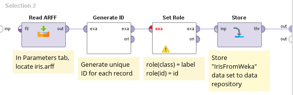

#### **Target Roles** in Rapid Miner
- ID : unique ID for each record
- Regular : input attribute = default role
**Learning / classification task**
- Label : target variable or class
- Prediction : classification result
- Weight : weight of record with respect to label
**Clustering task**
- Cluster : cluster membership (assigned by clustering model)

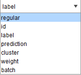

**Set roles**
- attribute class : set role as "label"
- attribute id : set role as "id"

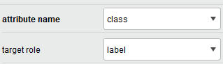

- Store IrisFromWeka to our LOCAL repo (we can set the file name to whatever we want) so **we can work on it later, not temporaily**
#### Subprocess 3

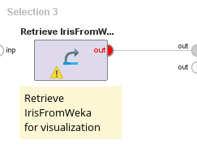

- Retrieve IrisFromWeka for visualization

### Ex 2.2 Aggregation and Pivot

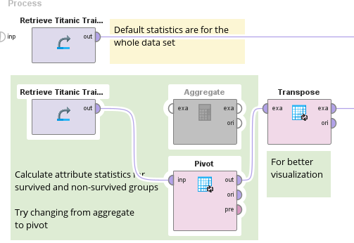

#### Aggregation
Summarize data by **grouping and calculating statistics** (like sum, average, count, etc.)
We choose **one or more grouping attributes** (variables) and for each group, we calculate aggregations such as count, sum, mean, min, max , SD

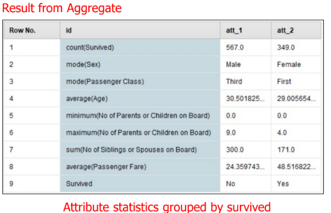

Aggregation by Survived : 
- **Survive = No** (attr_1): calculate count, mode of sex, class, average age, passenger flare, etc
- **Survive = yes** (attr_2) : calculate count, mode of sex, class, average age, passenger flare, etc
This is like **summarizing data from the people who survived and didnt,** are they male/female, from first/second/third, average salaries, etc
** Summarize data at a **higher level**
#### Pivot
**Rearrange data** by turning unique values of one column into **separate columns**
We select
- Grouping attribute : rows
- **Pivot attributes** : values that will become **new columns**
- Aggregation function : **what to calculate** in the new table

**Example** :
- We set group by attributes as **Survived** (att_1 = No, attr_2 = Yes)
- Column grouping attribute as **Sex** (pivoting)
	- Female/Male will become column headers, means creating NEW columns for each unique value of Sex (female, male) like AverageAge_female, male
	- IMPORTANT, column grouping attr has to be **nominal value ONLY**
- Aggregation attributes as everything except Sex

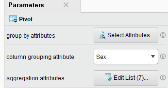

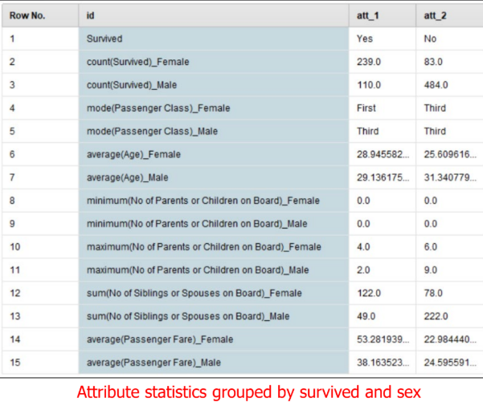

- Purpose of pivoting : reshape to make side by side comparisons easier