# Classification Methods 1
- **Classification**
	- Learning Phase -> build a model
	- Prediction Phase -> apply model to data
- [**Decision Trees**](#decision-trees)
	- Tree construction : Hunt's algorithm
		- How to determine the best split 
			- Goal : **each node contains records from the same class**
		- When to stop growing tree
	- Attribute Selection : Gini, entropy, information gain, gain ratio
	- Split Penalty
	- Pre-pruning vs Post-pruning
- [**Rule Induction**](#rule-induction)
	- Properties of rule set & resolution : exhaustive, mutually exclusive
	- OneR (single rule induction)
	- Sequential Covering & Rule growing

## Decision Trees
- Hunt's Algorithm (Tree construction)
- Pre-Pruning and Post-Pruning (When to stop growing tree)
### Hunt's Algorithm (How to build a tree)
---
Consider : How to determine the best split?, When to stop growing tree?
- Starting at root, with all training methods
- **Loop**:
	- Choose **1 attribute** that **best splits the records** to be the tree node (root of subtree)
	- Split the records by the chosen attributes into K child nodes
	- If a child node contains records from > 1 class, further split to get purer partitions
	
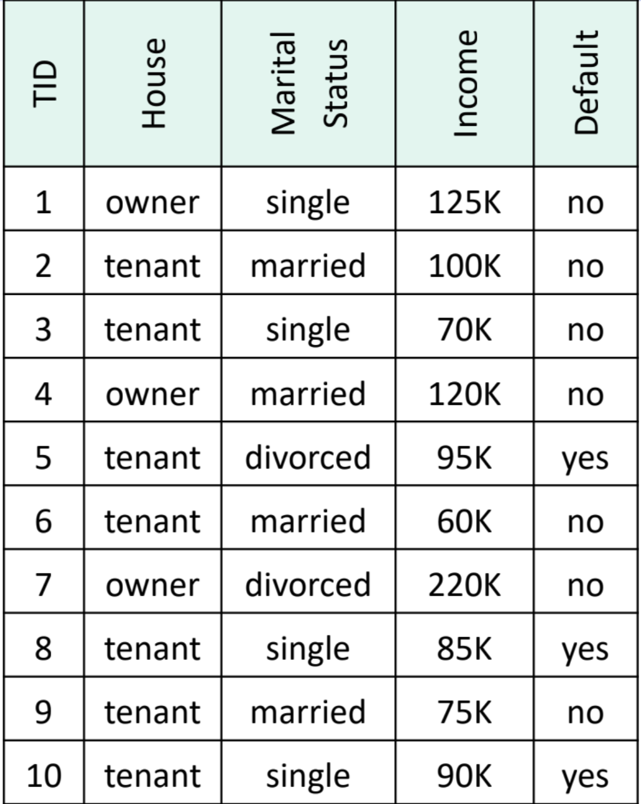 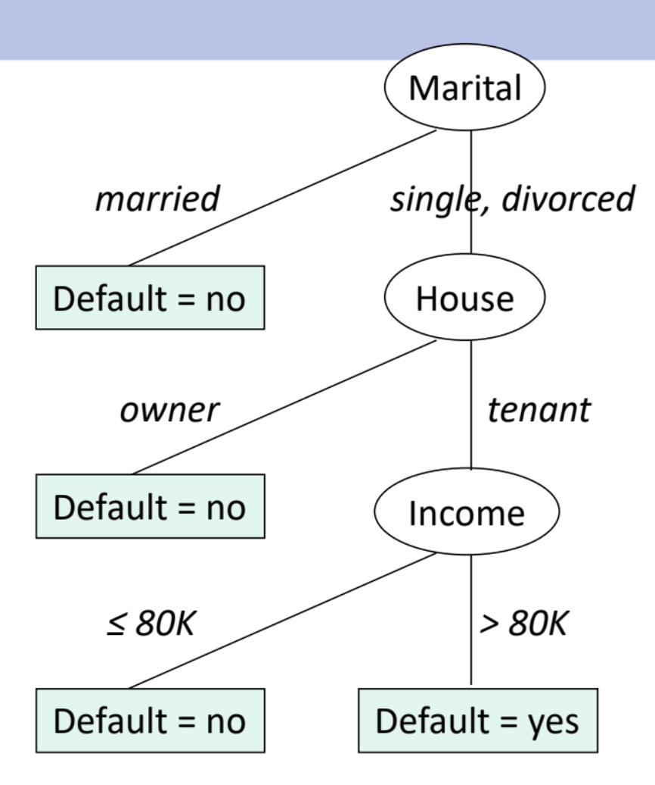
	
- **Goal** : each node contains records from the same class
- **Pick the best split from** :
	- ==Split by house== : (owner, tenant)
	- ==Split by martial== : (single, married, divorced), (single+married, divorced), (single, married+divorced),(single+divorced, married)
	- ==Split by income== : best splits from entropy-based discretization
	**Gini and Entropy formulas**
	
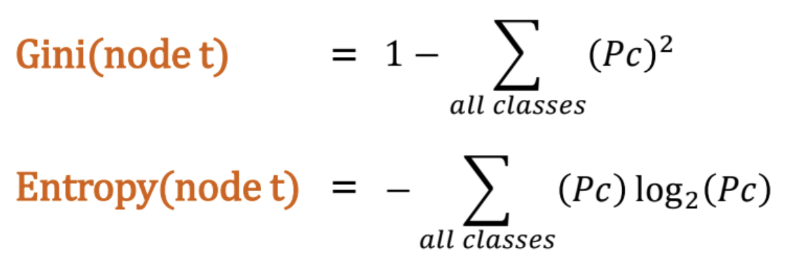
	
### Gini and Entropy Calculation

1. At **root node,** the whole data has **3 yes + 7 no**
	- Gini(root) = 1 - (3/10)squared -(7/10)squared = 0.42
	- Entropy(root) = - 3/10 log (3/10) - 7/10 log (7/10) = 0.8813
2. Pick the best split (by house, martial or income?), which one gives a higher information gain
	- **Split by house** : {owner, tenant}
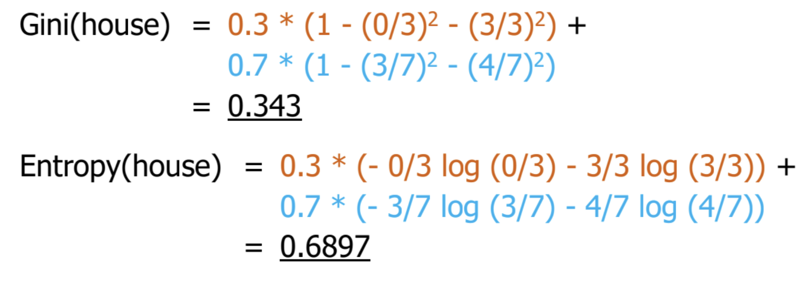 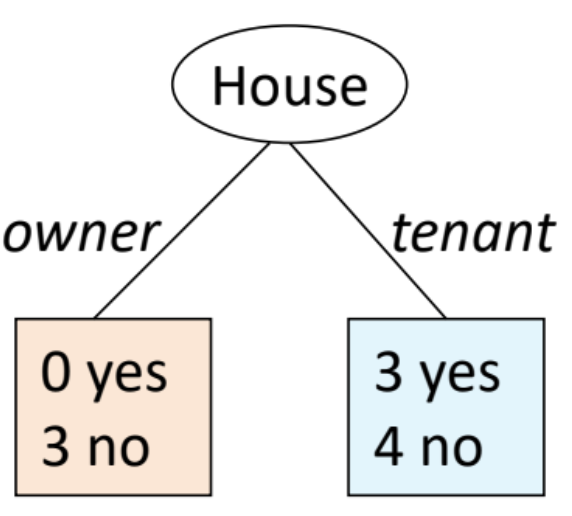

- Information Gain (Gini) : 0.42 - 0.343 = 0.077
- Information Gain (Entropy) : 0.8813 - 0.6897 = 0.1916
	- **Split by Marital status** : {single+divorce, married}

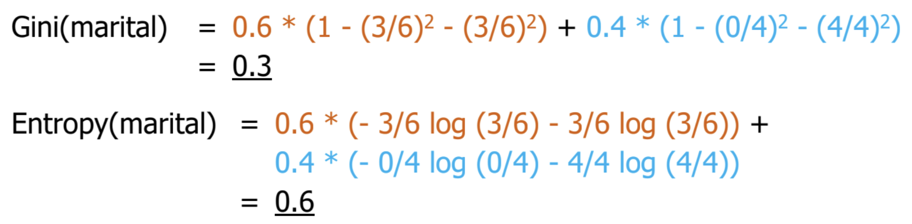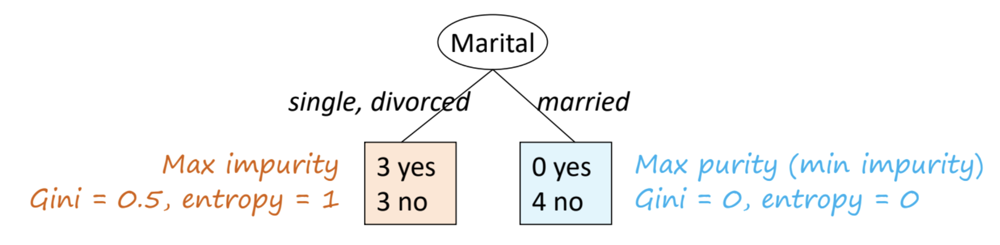

- Information Gain (Gini) : 0.42 - 0.3 = 0.12
- Information Gain (Entropy) : 0.8813 - 0.6 = 0.2813
	- **Split by Marital Status (Multiway)** : {single, divorced, married}

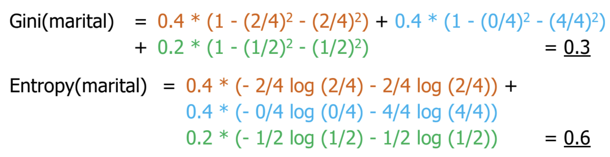

- Information Gain (Gini) : 0.42 - 0.3 = 0.12
- Information Gain (Entropy) : 0.8813 - 0.6 = 0.2813
	- **Split by Income (Entropy Based discretization)**
	Which is the best split? Calculate Gini or entropy for all of them

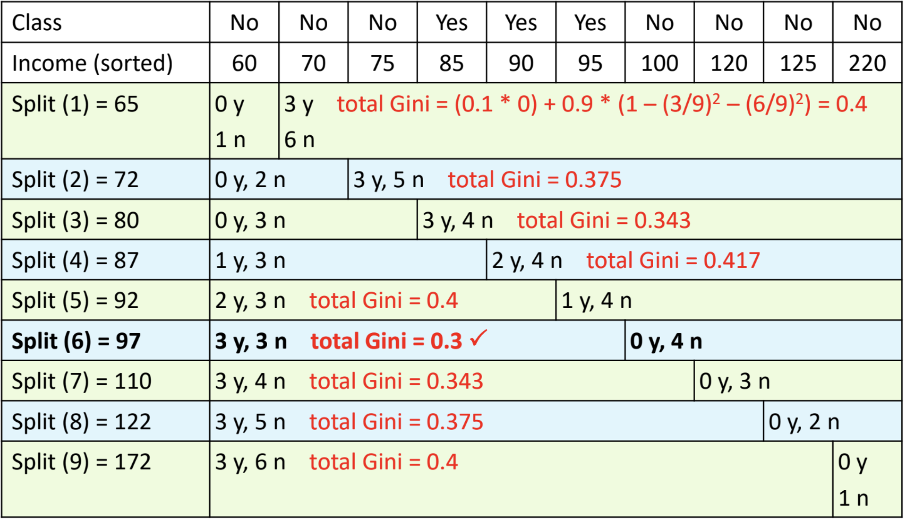

- Split between 95,100 has the lowest Gini = 0.3
** For multiclass problem, **Gini may > 0.5 and entropy may > 1**

### Split Penalty
---
Problem : If we allow the algorithm to keep splitting wherever it improves class purity, it will :
- Create **many very small bins** (even one value per bin).
- That gives **perfect separation** on the training data, but leads to **overfitting**.
Thats where a **penalty for making too many splits** comes into play, to balance accuracy vs. simplicity

**Split penalty is the rule that**
- **Reduces the “score”** of a split if it creates too many bins.
- Forces the algorithm to **stop splitting** unless the gain in information is **worth** the complexity.

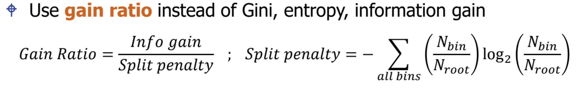

**Example : Split Penalty Calculation**

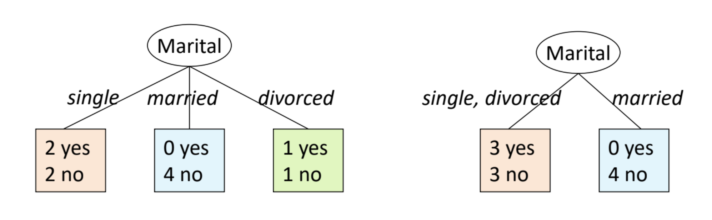

- Data at root = 10 records
- Penalty for **multiway split** = - 0.4 log 0.4 - 0.4 log 0.4 - 0.2 log 0.2 = ==1.522==
- Penalty for **binary split** = - 0.6 log 0.6 - 0.4 log 0.4 = ==0.971==
- So, binary split for Marital is the **better split**

### Pre-Pruning
---
- Stop before the tree is fully grown to fit the entire data
- Some stopping conditions are
		- **All records** in a node **belong to the same class**
		- All records in a node have **identical attribute values**
		- Node size is **too small**
		- Benefit of further split is too small
		- **Maximum depth** is reached
### Post-Pruning
---
- Let the tree grow to its **maximum size** and prune it afterwards
	- Replace the whole subtree with a **leaf node or a smaller subtree**
	- Split data by **using new root**
	- Between **full tree** and **pruned trees**, **choose the one with lower error**
- ==Optimistic Approach== : error = # minority records
- ==Pessimistic Approach== : error = # minority records + **penalty** (more complex tree -> more penalty)
- ==Pruning Data Approach== : reserve a subset of training data & apply the tree to this subset

**Example, this is our tree (max size) and our actual data it learned from**

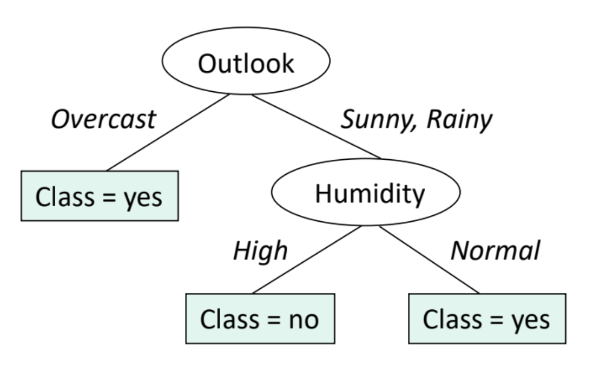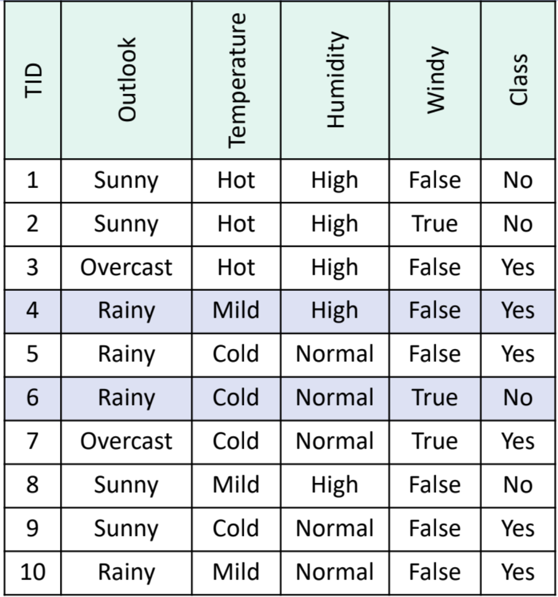

- 2 data = error records (blue highlights, minority records)
- Suppose that **pessimistic estimation = training error records + 0.5 (#leafs)**
- Optimistic error : 2/10
- Pessimistic error : 2 + (0.5 x 3) = 3.5 records = 0.35

**Example 2 : Bigger tree**

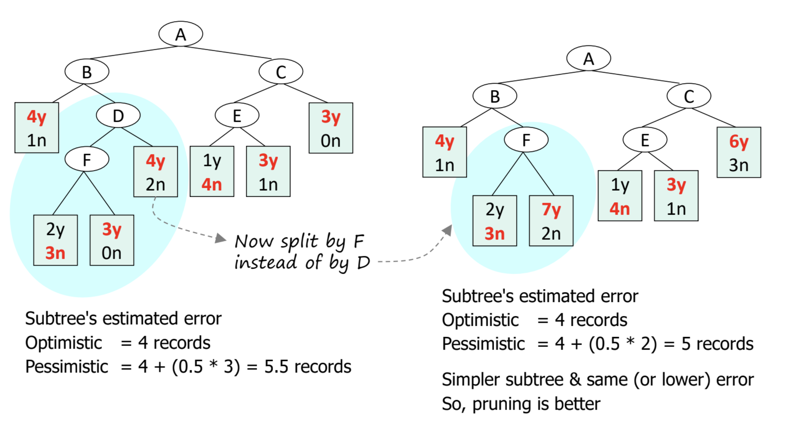

- **Split by D** (max tree size) vs **Split by F** (D's subtree, pruned)
	- Split by F has a lower error in pessimistic records than split by D 
	- So, we can conclude that **pruning is better**

## Rule Induction
**Rule induction** is a machine learning technique where we extract **if–then rules** from data
- Instead of a black-box model (like a neural net), we get interpretable rules
- Each rule links **attribute conditions** to a **class label** (or prediction)
- Given A = **no.of records satisfying the rule**
- Given D = **size of dataset**
- ==Coverage/Support== = no.of records satisfying the rule/size of dataset

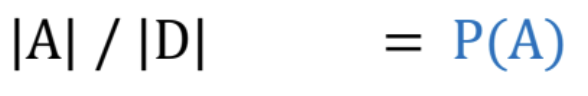

- ==Accuracy/Confidence== = given y = class (prediction)

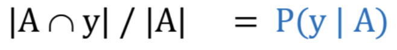

**Example** : **Given Rule set** 
- R1: (give birth = no) and (can fly = yes) -> Birds
- R2: (give birth = no) and (live in water = yes) -> Fishes
- R3: (give birth = yes) and (blood = warm) -> Mammals
- R4: (give birth = no) and (can fly = no) -> Reptiles
- R5: (live in water = sometimes) -> Amphibians

**Testing Records**
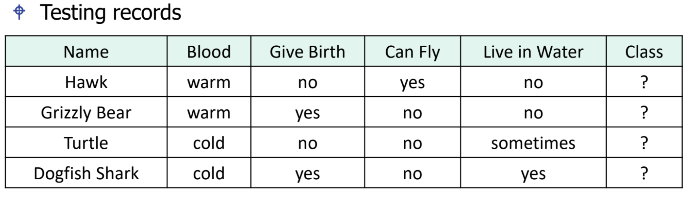

**Calculate Coverage and Accuracy of R4 (give birth = no) and (can fly = no) = class Reptiles**
- Coverage of R4 : 
	- From training data, 10 records satisfy this precondition
	- Coverage(R4) = 10/20 = 50%
- Accuracy of R4 : 
	- Fraction of records (covered by the rules) that **satisfies precondition and class**
	- From 10 records covered by R4, **4 of them are reptiles**
	- Accuracy(R4) = 4/10 = 40%

### Required Properties of Rule set
---
==**Exhaustive**==
- A rule set has exhaustive coverage if it accounts for every possible
combination of attribute values
- refers to an approach or strategy that **examines all possible patterns, combinations, or subsets of data** to ensure that **no potential pattern or rule is missed**.
- Otherwise, we won't be able to predict class for some records
- Fixed by **adding default rule** (if record doesn't satisfy any rule)
==**Mutually Exclusive**==
- If a rule set is mutually exclusive, every possible record is covered by
at most one rule ➔ in practice, a **record covered by many rules is still**
**acceptable** if those rules **predict the same class**
- Otherwise, there will be **multiple conflicting classes** for 1 record
- Fixed by using **conflict resolution**

### Conflict Resolution
---
- **==Rule Unordering Approach==** 
	Strategy 1 : Among all conflicted rules ➔ **Choose Majority Class**
	- R1 -> Reptiles
	- R2 -> Reptiles
	- R3 -> Amphibians
	- Conclusion : **Predict Reptiles**
	Strategy 2 : **Weighted Voting** (by accuracy)
	- R1 -> Reptiles : accuracy 0.3
	- R2 -> Reptiles : accuracy 0.4
	- R3 -> Amphibians : accuracy 0.9
	- Conclusion : **Predict Amphibians**
- **==Rule Ordering Approach==**
	- **Rule-by-rule ordering** : sort rules by individual quality measures (like accuracy)
	- **Class-by-class ordering** : group rules that predict the same classes &
sort classes

### Rule Construction
---
- ==**Indirect Approach**== : Convert decision tree to rules
	- RapidMiner operation : Tree to Rules
	
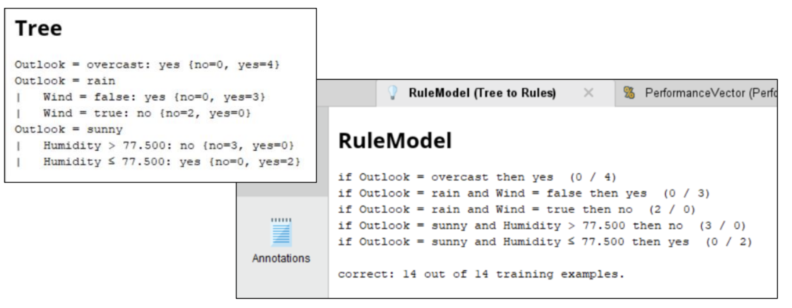

- ==**Direct Approach**== : OneR, RIPPER
	- **OneR (Single Rule Induction)**
		- Extract rules directly from training data
		- If it is **==nominal attribute==** with n categories ➔ split records into n bins and generate rules
			- if (attribute = category j), prediction = **majority class in bin j**
		- If it is **==numeric attribute==** ➔ find best splits from discretization ➔ split records into n bins and generate rules
			- if (attribute **is in range j**), prediction = majority class in bin j
	- **RIPPER**

