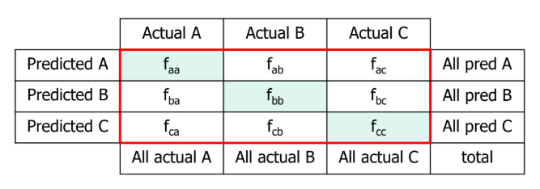
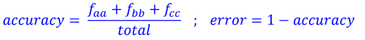
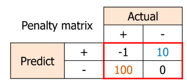
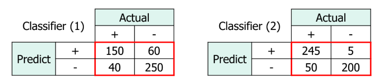
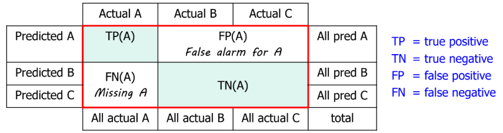
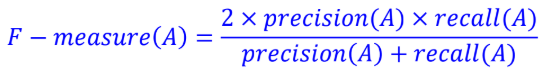
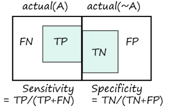
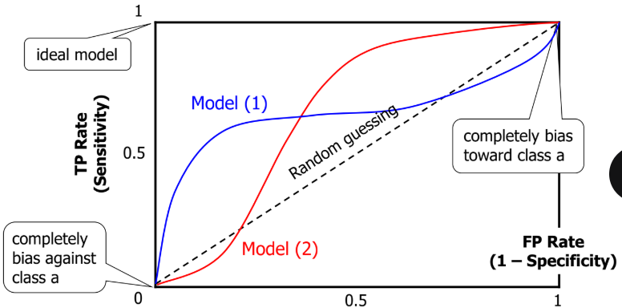
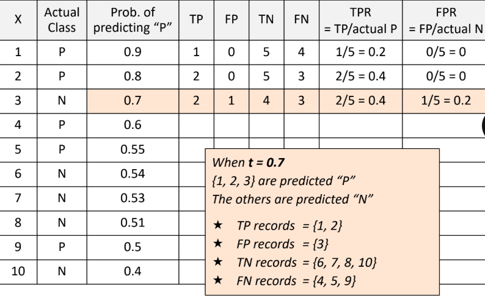
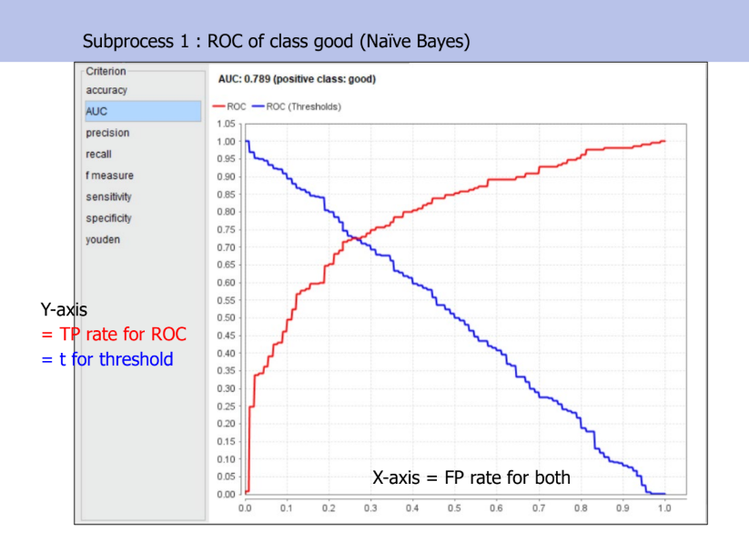

# Model Performance Evaluation🎭
- Run Classifier on testing data to get **preliminary performance**
	- **Overall Performance** -> accuracy
	- **Per-Class Performance** -> precision, recall, F-measure
	- **Overfitting/underfitting** -> training vs testing performance
		- **Overfit** = bad testing performance, trained data too well (even with noise), so it performs great on training but poor on unseen data 
		- **Underfit** = bad training AND testing performance, model is too simple
	- **Adjust parameters & preprocessing**, or **try other classifiers** to obtain good performance
- Formal Performance Statistics
	- Run classifier in validation mode to get **formal statistics**
	- Create final working model from full data set
- Other evaluation
	- **Sensitivity, specificity, J-Index**
	- ROC Curve (TP rate vs FP rate)
## Overall Performance (accuracy)
### Confusion Matrix

- fpa = # records **predicted as p** & **actual class is a**
- green highlight = predict correctly
###  Overall accuracy and error

### Limitation of accuracy
- suppose records in class 0 = 9900, class 1 = 100 (data BIAS towards class 0)
- every record is predicted to be in class 0
	- accuracy 99% but **not a good model because it is unable to detect class 1 (it thought almost every new data belongs to class 0)**
### Solution : Penalty / Cost Analysis

- Failing to detect (+) is a **severe mistake** -> high penalty (red)
- Falsely detect (+) is NOT a severe mistake -> low penalty (blue)
- 100 = high penalty cost, 10 = low penalty cost
- Can use **profit** instead of penalty & **consider classifier with higher profit**

**Classifier 1**
- Accuracy = (150+250)/500 = 0.80
- Penalty = (-1 x 150) + (60 x 10) + (40 x 100) + (250 x 0) = 4450
**Classifier 2**
- Accuracy = (245+200)/500 = 0.89
- Penalty = (-1 x 245) + (5 x 10) + (5 x 100) + (200 x 0) = 4805 
- Even tho it predicts more correctly, it has higher penalty because it failed to predict (+) more than classifier 1, which is a severe mistake
## Per-class Performance 
- A classifier with high accuracy may be **good at predicting one class**, but **bad at predicting another** (its possible!), so we need "per-class formance"
- TO analyze per-class performance
	- Positive = class in focus (eg. class A)
	- Negative = other classes (eg. class B+C)

### Recall (A)
- **Recall (A)** or TP rate (A) = ability to **retrieve actual A from the dataset**
	= TP (A) / all actual (A) 
	= **TP(A) / (TP(A)+FN(A))**
	** FN(A) is actual A but falsely predicted as B+C (missing A)
### Precision (A)
- **Precision (A)** = reliability of positive prediction (how precise it is)
	= TP (A) / all pred (A) 
	= **TP(A) / (TP(A)+FP(A))**
	** FP(A) is B+C but falsely predicted as A (irrelevant records)
- To get a **perfect recall** -> minimize FN(A) by **making the classifier bias toward class A** -> may lead to higher FP(A) & **worsen precision**
- To get a perfect precision -> minimize FP(A) by *making the classifier bias against class A* -> may lead to higher FN(A) & worsen recall
### F-Measure (A), or F1-score
- trade off between precision and recall

- **Averaging performance from both classes**
	- weighted avg f-measure in a classifier
		- proportion of class (A) x f1 of class (A) + proportion of class (B) x f1 of class (B)
- **Comparing weighted avg metrics** (which classifier is better)
	- one classifier can be better but more bias towards one class
	- if predicting other class is much more important that predicting the dominant class, then that one classifer is bad
### Determining which classifier is better depends on applications and the purposes of data analysis
- **Regardless of cost/profit** -> do we want best **overall** model or best model **for a certain class**?
- **With respect to cost/profit** -> different cost/profit matrices may give different conclusions
#### Consider only cost
- RapidMiner = Performance cost
- **Set penalty** (Class A is the class of focus)
	- eg. Class A labelled as B (FN) -> low penalty = 1
	- eg. Class B labelled as A (FP) -> high penalty = 20
- **Avg cost of Classifier X**
	- Total cost = (20 * FP) + (1 * FN) 
	- Average cost = Total cost/total records
- Lower average cost (**of wrong prediction**) -> better at avoiding mistaking bad customers as good ones (FP)
- But if set more penalty for FN, meaning we're detecting if the classifier can avoid failing to detect class A (A predict as B instead)
#### Consider only profit
- RapidMiner = Performance Profit
- **Set Profit** (Class A is the class of focus)
	- eg. Detected customer in class A (TP) -> high profit = 10
	- eg. Detected customer in class B (TN) -> Low profit = 1
- **Avg profit of Classifier X**
	- Total Profit = (10 * TP) + (1 * TN)
	- Average Profit = Total profit/total records
- If a classifer gives a higher average profit (**of correct prediction**) -> better at picking good customers (TP)
#### Consider both cost and profit
- Set penalty and profit
- For profit, set to **negative values** 
- For cost, set to **positive values**
- If the performance (total cost + profit) gives a more negative value = **that classifier gives higher profit**
## Other Evaluations
### Sensitivity (A)
- TP rate or recall (A)
- **TP(A) / all actual (A)**
- Sensitivity  = 1 -> The tests are **positive for all patients with disease** (patient with disease is the 1st class), perfect recall
### Specificity (A)
- **TN(A) / all actual (~A)**
- TN / (TN+FP)
- actual (~A) is actual (another class)
- Ability to clear irrelevant cases that we dont want
- Specificity = 1 -> The test are **negative for all patients without disease** (patient without disease is the 2nd class)
### Youden's J-index (A)
- **J = sensitivity(A) + specificity(A) - 1** ; 0<=J<=1
- J = 1 indicates perfect test
- J = 0 indicates useless test

## ROC (Receiver Operating Characteristic)
- only available in binary classification and for positive class
- evaluate how well a binary classifier distinguishes between two classes (e.g., _positive_ vs _negative_)
### ROC Curve plots
- True Positive Rate (TPR) on the Y-axis (Recall/Sensitivity)
	**TPR = TP / (TP + FN)**
- False Positive Rate (FPR) on the X-axis (False alarms)
	**FPR = FP / (FP + TN)**
Each point on the ROC curve represents the model’s performance at a different **classification threshold** (the cutoff for predicting positive).
- A **perfect classifier** hugs the **top-left corner** (TPR = 1, FPR = 0)
- A **random classifier** lies along the diagonal line (TPR = FPR)
### Area under curve (AUC)
The **AUC (Area Under Curve)** condenses the ROC into one number:
- **AUC = 1.0** → perfect classification
- **AUC = 0.5** → random guessing
- **AUC < 0.5** → worse than random
So, a **higher AUC** means a **better classifier** for distinguishing between the two classes.

### Interpreting ROC Curve
- Trade off between Positive hits (TP) and false alarms (FP) (TP rate)
- Diagonal line implies **random guessing (AUC 0.5)**
	- **Above diagonal = good model**
	- Below diagonal = bad model (predict the opposite of true class)
	- Model 1 and 2, none is clearly better than the other
		- At small FP rate (left), model 1 is better
		- At large FP rate (right), model 2 is better, meaning having more TP rate at that moment
	- So **we compute area under ROC curve (AUC)**
		- model with bigger area is better on average
### Plotting ROC Curve
- Positive class (P) = class being analyzed
- Negative class (N) = other classes
1. For each testing record X (X has actual class, and probabilty of predicting that class), **calculate confidence or prob. that X is positive**
2. Sort all testing records in decreasing order of their prob. In case that > 1 records have equal prob
	- Optimistic ROC = correct prediction (actual class = P) comes first
	- Pessimistic ROC = incorrect prediction comes first
	- Neutral ROC = alternate between optimistic and pessimistic
3. for **each treshold t**
	- If **P(X) >= t, predict Positive**
	- Calculate TP rate **(TPR = TP / actual P)** and FP rate **(FPR = FP / actual N)** for this threshold

**Example, t = 0.7**, only X1,X2,X3 have probability of predicting P equals or more than 0.7, so predict them as P. 
For the rest, predict as N
**In every row, update the TP and FP** once the ROC curve makes a prediction based on treshold. Also, update the TPR and FPR

** in conclusion, threshold is the cut off line for the model to predict positive or negative (if probability of predicting a class is above treshold, predict pos)

- **Red =ROC Curve, (TP Rate)**
	- This shows how sensitivity/recall changes as the classification **threshold (t)** varies
	- It’s the actual ROC part (TPR vs. FPR).
- **Blue = Threshold (t)**
	- helper line, helps us choose the **best cutoff** for the model
	- At each point on the ROC curve, the model was using this particular threshold value
	- When threshold is **high (near 1.0)** → we predict very few positives → low TPR, low FPR
	- When threshold is **low (near 0)** →we predict almost everything as positive → high TPR, high FPR
- AUC = overall **quality of separation** (here ≈ 0.79 = fair performance)

